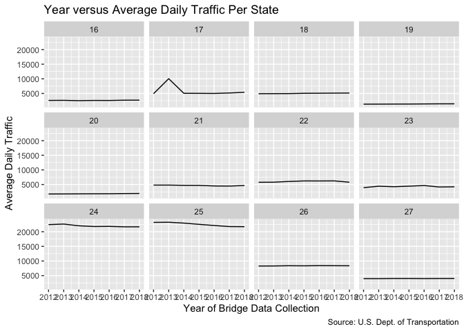

Homework 2: Unemployment Prediction
===================================

Install necessary packages.

    #install.packages("blscrapeR")
    library(blscrapeR)
    library(data.table)
    library(dplyr)

    ## 
    ## Attaching package: 'dplyr'

    ## The following objects are masked from 'package:data.table':
    ## 
    ##     between, first, last

    ## The following objects are masked from 'package:stats':
    ## 
    ##     filter, lag

    ## The following objects are masked from 'package:base':
    ## 
    ##     intersect, setdiff, setequal, union

    library(ggplot2)
    library(tidyverse)

    ## ── Attaching packages ─────────── tidyverse 1.3.0 ──

    ## ✔ tibble  2.1.3     ✔ purrr   0.3.3
    ## ✔ tidyr   1.0.0     ✔ stringr 1.4.0
    ## ✔ readr   1.3.1     ✔ forcats 0.4.0

    ## ── Conflicts ────────────── tidyverse_conflicts() ──
    ## ✖ dplyr::between()   masks data.table::between()
    ## ✖ dplyr::filter()    masks stats::filter()
    ## ✖ dplyr::first()     masks data.table::first()
    ## ✖ dplyr::lag()       masks stats::lag()
    ## ✖ dplyr::last()      masks data.table::last()
    ## ✖ purrr::transpose() masks data.table::transpose()

First, I gather bridge data for 12 states through 2012-2018 in 12\*7
separate files, and then I combine the files into one master file.

    for(statee in c("ID", "IL", "IN", "IA", "KS",
                    "KY", "LA", "ME", "MD", "MA",
                    "MI", "MN")){
      for(yearr in 2012:2018){
        URL <- paste0("https://www.fhwa.dot.gov/bridge/nbi/",
                     yearr,
                     "/delimited/",
                     statee,
                     substr(yearr, 3,4),
                     ".txt"
                     )
        tib_name <- paste0(statee,yearr) # assigning a specific name (STATE.ABBYEAR) to each file
        
        assign(tib_name, fread(URL) %>% 
                 as_tibble() %>% 
                 # Explains each var in detail: https://www.fhwa.dot.gov/bridge/mtguide.pdf
                 select(STATE_CODE_001,
                        COUNTY_CODE_003,
                        ADT_029,
                        TOTAL_IMP_COST_096, #  all costs  associated with the proposed bridge improvement project
                        contains("COND")) %>% 
                 # Can only use states with a state fips code of 2 digits to use this code
                 mutate(fips = STATE_CODE_001*1000 + COUNTY_CODE_003,
                        year_of_data = yearr,
                        improve_cost = TOTAL_IMP_COST_096*1000) # Cost was in thousands of dollars originally
               )
        }
      }

    # Joining all bridges files into one main file
    br <- rbind(ID2012, ID2013, ID2014, ID2015, ID2016, ID2017, ID2018,
                IL2012, IL2013, IL2014, IL2015, IL2016, IL2017, IL2018,
                IN2012, IN2013, IN2014, IN2015, IN2016, IN2017, IN2018,
                IA2012, IA2013, IA2014, IA2015, IA2016, IA2017, IA2018,
                KS2012, KS2013, KS2014, KS2015, KS2016, KS2017, KS2018,
                KY2012, KY2013, KY2014, KY2015, KY2016, KY2017, KY2018,
                LA2012, LA2013, LA2014, LA2015, LA2016, LA2017, LA2018,
                ME2012, ME2013, ME2014, ME2015, ME2016, ME2017, ME2018,
                MD2012, MD2013, MD2014, MD2015, MD2016, MD2017, MD2018,
                MA2012, MA2013, MA2014, MA2015, MA2016, MA2017, MA2018,
                MI2012, MI2013, MI2014, MI2015, MI2016, MI2017, MI2018,
                MN2012, MN2013, MN2014, MN2015, MN2016, MN2017, MN2018
                )

    # Changing column types so I can join on those cols later
    br$fips <- as.character(as.integer(br$fips))
    br$STATE_CODE_001 <- as.character(br$STATE_CODE_001)

### Part 1: Making facets over states with x-axis as time and y-axis as average daily traffic

    br %>% 
      select(STATE_CODE_001, year_of_data, DECK_COND_058, SUPERSTRUCTURE_COND_059, 
             SUBSTRUCTURE_COND_060, CHANNEL_COND_061, CULVERT_COND_062, ADT_029, TOTAL_IMP_COST_096) %>% 
      group_by(STATE_CODE_001, year_of_data) %>% 
      # Need to remove "N" (means "Not Applicable") from the condition columns
      mutate(DECK_COND_058 = na_if(DECK_COND_058, "N"),
             SUPERSTRUCTURE_COND_059 = na_if(SUPERSTRUCTURE_COND_059, "N"),
             SUBSTRUCTURE_COND_060 = na_if(SUBSTRUCTURE_COND_060, "N"),
             CHANNEL_COND_061 = na_if(CHANNEL_COND_061, "N"),
             CULVERT_COND_062 = na_if(CULVERT_COND_062, "N")) %>% 
      rename(st = STATE_CODE_001) %>% 
      summarize(count = n(), 
                deck = mean(as.numeric(DECK_COND_058), na.rm = T),
                super = mean(as.numeric(SUPERSTRUCTURE_COND_059), na.rm=T),
                sub = mean(as.numeric(SUBSTRUCTURE_COND_060), na.rm=T),
                channel = mean(as.numeric(CHANNEL_COND_061), na.rm=T),   
                culvert = mean(as.numeric(CULVERT_COND_062), na.rm=T),
                avg_daily_traff = mean(ADT_029, na.rm = T),
                avg_imp_cost = mean(TOTAL_IMP_COST_096, na.rm = T)) %>% 
      ggplot() +
      geom_line(aes(x = year_of_data,
                    y = avg_daily_traff)) +
      labs(x = "Year of Bridge Data Collection", 
           y = "Average Daily Traffic",
           title = "Year versus Average Daily Traffic Per State",
           caption = "Source: U.S. Dept. of Transportation") +
      scale_x_continuous(breaks  = c(2012, 2015, 2018)) +
      facet_wrap(~ st)

### Part 2: Now joining the average of the bridge data over the years to BLS data

    bls <- get_bls_county("December 2018")

    br_bls <- br %>% 
      group_by(fips) %>% 
      # Need to remove "N" (means "Not Applicable") from the condition columns
      mutate(DECK_COND_058 = na_if(DECK_COND_058, "N"),
             SUPERSTRUCTURE_COND_059 = na_if(SUPERSTRUCTURE_COND_059, "N"),
             SUBSTRUCTURE_COND_060 = na_if(SUBSTRUCTURE_COND_060, "N"),
             CHANNEL_COND_061 = na_if(CHANNEL_COND_061, "N"),
             CULVERT_COND_062 = na_if(CULVERT_COND_062, "N")) %>% 
      summarize(count = n(), 
                deck = mean(as.numeric(DECK_COND_058), na.rm = T),
                super = mean(as.numeric(SUPERSTRUCTURE_COND_059), na.rm=T),
                sub = mean(as.numeric(SUBSTRUCTURE_COND_060), na.rm=T),
                channel = mean(as.numeric(CHANNEL_COND_061), na.rm=T),   
                culvert = mean(as.numeric(CULVERT_COND_062), na.rm=T),
                avg_daily_traff = mean(ADT_029, na.rm = T),
                avg_imp_cost = mean(TOTAL_IMP_COST_096, na.rm = T)) %>% 
      left_join(bls)

    ## Joining, by = "fips"

    # Checking the joined tables do not have duplicate zipcodes
    # the br_bls table should be summaries of the bridge and BLS data for each zipcode
    br_bls %>% 
      group_by(fips) %>% 
      summarise(n = n()) %>% 
      filter(n > 1)

    ## # A tibble: 0 x 2
    ## # … with 2 variables: fips <chr>, n <int>

    # Empty tibble means it passes the duplication check

### Part 3: Using the bridges data to find features that are predictive of unemployment

**Fit a linear model to predict the number of unemployed.**

    mod1 <- lm(unemployed ~ count + super + sub + channel + culvert + avg_daily_traff + avg_imp_cost, data = br_bls)
    summary(mod1)

    ## 
    ## Call:
    ## lm(formula = unemployed ~ count + super + sub + channel + culvert + 
    ##     avg_daily_traff + avg_imp_cost, data = br_bls)
    ## 
    ## Residuals:
    ##    Min     1Q Median     3Q    Max 
    ##  -9936   -816    107    852  60882 
    ## 
    ## Coefficients:
    ##                   Estimate Std. Error t value Pr(>|t|)    
    ## (Intercept)     -4.432e+03  2.108e+03  -2.103 0.035824 *  
    ## count            1.808e+00  1.139e-01  15.876  < 2e-16 ***
    ## super           -7.860e+02  5.671e+02  -1.386 0.166153    
    ## sub              3.673e+02  4.658e+02   0.789 0.430535    
    ## channel          1.067e+03  3.122e+02   3.417 0.000666 ***
    ## culvert         -3.247e+02  2.318e+02  -1.401 0.161725    
    ## avg_daily_traff  3.762e-01  2.121e-02  17.736  < 2e-16 ***
    ## avg_imp_cost     5.706e-03  4.532e-03   1.259 0.208437    
    ## ---
    ## Signif. codes:  0 '***' 0.001 '**' 0.01 '*' 0.05 '.' 0.1 ' ' 1
    ## 
    ## Residual standard error: 2904 on 763 degrees of freedom
    ##   (80 observations deleted due to missingness)
    ## Multiple R-squared:  0.6047, Adjusted R-squared:  0.6011 
    ## F-statistic: 166.8 on 7 and 763 DF,  p-value: < 2.2e-16

**Fit another model to predict the unemployment rate.**

    mod2 <- lm(unemployed_rate ~ count + super + sub + channel + culvert + avg_daily_traff + avg_imp_cost, data = br_bls)
    summary(mod2)

    ## 
    ## Call:
    ## lm(formula = unemployed_rate ~ count + super + sub + channel + 
    ##     culvert + avg_daily_traff + avg_imp_cost, data = br_bls)
    ## 
    ## Residuals:
    ##     Min      1Q  Median      3Q     Max 
    ## -3.2094 -1.0707 -0.3018  0.8942 13.9091 
    ## 
    ## Coefficients:
    ##                   Estimate Std. Error t value Pr(>|t|)   
    ## (Intercept)      2.621e+00  1.184e+00   2.214  0.02711 * 
    ## count           -2.081e-04  6.395e-05  -3.254  0.00119 **
    ## super           -6.192e-01  3.185e-01  -1.944  0.05224 . 
    ## sub              8.049e-01  2.616e-01   3.077  0.00216 **
    ## channel          2.440e-01  1.753e-01   1.392  0.16436   
    ## culvert         -1.146e-01  1.302e-01  -0.880  0.37894   
    ## avg_daily_traff -2.615e-05  1.191e-05  -2.195  0.02847 * 
    ## avg_imp_cost    -3.581e-06  2.545e-06  -1.407  0.15990   
    ## ---
    ## Signif. codes:  0 '***' 0.001 '**' 0.01 '*' 0.05 '.' 0.1 ' ' 1
    ## 
    ## Residual standard error: 1.631 on 763 degrees of freedom
    ##   (80 observations deleted due to missingness)
    ## Multiple R-squared:  0.05559,    Adjusted R-squared:  0.04693 
    ## F-statistic: 6.416 on 7 and 763 DF,  p-value: 2.353e-07

**Then, use the unemployed number and rate from the previous month as
additional predictors.**   The bridges data changes by year, and the
BLS data changes by month.   To make the data match as the bridges
data for that year fit with the BLS data of the month, I will make a
model that takes the bridges data and unemployment number/rate from 2018
as features in a model to predict the unemployment rate of December 2019
(the most recent bridges data is from 2018).

    br_2018 <- rbind(ID2018, IL2018, IN2018, IA2018, KS2018, KY2018, 
                     LA2018, ME2018, MD2018, MA2018, MI2018, MN2018)
    br_2018$fips <- as.character(as.integer(br_2018$fips))
    br_2018$STATE_CODE_001 <- as.character(br_2018$STATE_CODE_001)

    bls_2018_2019 <- get_bls_county(c("December 2018", "December 2019"))

    br_bls_2018_2019 <- br_2018 %>% 
      drop_na(fips) %>% 
      group_by(fips) %>% 
      # Need to remove "N" (means "Not Applicable") from the condition columns
      mutate(DECK_COND_058 = na_if(DECK_COND_058, "N"),
             SUPERSTRUCTURE_COND_059 = na_if(SUPERSTRUCTURE_COND_059, "N"),
             SUBSTRUCTURE_COND_060 = na_if(SUBSTRUCTURE_COND_060, "N"),
             CHANNEL_COND_061 = na_if(CHANNEL_COND_061, "N"),
             CULVERT_COND_062 = na_if(CULVERT_COND_062, "N")) %>% 
      summarize(count = n(), 
                deck = mean(as.numeric(DECK_COND_058), na.rm = T),
                super = mean(as.numeric(SUPERSTRUCTURE_COND_059), na.rm=T),
                sub = mean(as.numeric(SUBSTRUCTURE_COND_060), na.rm=T),
                channel = mean(as.numeric(CHANNEL_COND_061), na.rm=T),   
                culvert = mean(as.numeric(CULVERT_COND_062), na.rm=T),
                avg_daily_traff = mean(ADT_029, na.rm = T),
                avg_imp_cost = mean(TOTAL_IMP_COST_096, na.rm = T)) %>% 
      left_join(bls_2018_2019)

    ## Joining, by = "fips"

    # Checking that each fips code is repeated twice, once for Dec 2018 and once for Dec 2019
    br_bls_2018_2019 %>% 
      group_by(fips) %>% 
      summarise(n = n()) %>% 
      filter(n != 2)

    ## # A tibble: 0 x 2
    ## # … with 2 variables: fips <chr>, n <int>

    # Creating the model using the unemployed number and rate from the previous month as additional predictors
    mod3 <- lm(br_bls_2018_2019$unemployed_rate[which(br_bls_2018_2019$period == '2019-12-01')] ~ 
                     br_bls_2018_2019$super[which(br_bls_2018_2019$period == '2018-12-01')] + 
                     br_bls_2018_2019$sub[which(br_bls_2018_2019$period == '2018-12-01')] + 
                     br_bls_2018_2019$channel[which(br_bls_2018_2019$period == '2018-12-01')] + 
                     br_bls_2018_2019$culvert[which(br_bls_2018_2019$period == '2018-12-01')] + 
                     br_bls_2018_2019$avg_daily_traff[which(br_bls_2018_2019$period == '2018-12-01')] +
                     br_bls_2018_2019$avg_imp_cost[which(br_bls_2018_2019$period == '2018-12-01')] +
                     br_bls_2018_2019$unemployed[which(br_bls_2018_2019$period == '2018-12-01')] + 
                     br_bls_2018_2019$unemployed_rate[which(br_bls_2018_2019$period == '2018-12-01')], data = br_bls_2018_2019)
    summary(mod3)

    ## 
    ## Call:
    ## lm(formula = br_bls_2018_2019$unemployed_rate[which(br_bls_2018_2019$period == 
    ##     "2019-12-01")] ~ br_bls_2018_2019$super[which(br_bls_2018_2019$period == 
    ##     "2018-12-01")] + br_bls_2018_2019$sub[which(br_bls_2018_2019$period == 
    ##     "2018-12-01")] + br_bls_2018_2019$channel[which(br_bls_2018_2019$period == 
    ##     "2018-12-01")] + br_bls_2018_2019$culvert[which(br_bls_2018_2019$period == 
    ##     "2018-12-01")] + br_bls_2018_2019$avg_daily_traff[which(br_bls_2018_2019$period == 
    ##     "2018-12-01")] + br_bls_2018_2019$avg_imp_cost[which(br_bls_2018_2019$period == 
    ##     "2018-12-01")] + br_bls_2018_2019$unemployed[which(br_bls_2018_2019$period == 
    ##     "2018-12-01")] + br_bls_2018_2019$unemployed_rate[which(br_bls_2018_2019$period == 
    ##     "2018-12-01")], data = br_bls_2018_2019)
    ## 
    ## Residuals:
    ##     Min      1Q  Median      3Q     Max 
    ## -2.0771 -0.3914 -0.0589  0.3176  4.5064 
    ## 
    ## Coefficients:
    ##                                                                                    Estimate
    ## (Intercept)                                                                       2.102e+00
    ## br_bls_2018_2019$super[which(br_bls_2018_2019$period == "2018-12-01")]            8.828e-01
    ## br_bls_2018_2019$sub[which(br_bls_2018_2019$period == "2018-12-01")]             -1.314e+00
    ## br_bls_2018_2019$channel[which(br_bls_2018_2019$period == "2018-12-01")]          2.589e-02
    ## br_bls_2018_2019$culvert[which(br_bls_2018_2019$period == "2018-12-01")]          8.748e-02
    ## br_bls_2018_2019$avg_daily_traff[which(br_bls_2018_2019$period == "2018-12-01")] -2.121e-06
    ## br_bls_2018_2019$avg_imp_cost[which(br_bls_2018_2019$period == "2018-12-01")]     1.729e-06
    ## br_bls_2018_2019$unemployed[which(br_bls_2018_2019$period == "2018-12-01")]      -7.705e-06
    ## br_bls_2018_2019$unemployed_rate[which(br_bls_2018_2019$period == "2018-12-01")]  9.355e-01
    ##                                                                                  Std. Error
    ## (Intercept)                                                                       5.355e-01
    ## br_bls_2018_2019$super[which(br_bls_2018_2019$period == "2018-12-01")]            1.218e-01
    ## br_bls_2018_2019$sub[which(br_bls_2018_2019$period == "2018-12-01")]              9.891e-02
    ## br_bls_2018_2019$channel[which(br_bls_2018_2019$period == "2018-12-01")]          7.133e-02
    ## br_bls_2018_2019$culvert[which(br_bls_2018_2019$period == "2018-12-01")]          5.265e-02
    ## br_bls_2018_2019$avg_daily_traff[which(br_bls_2018_2019$period == "2018-12-01")]  5.946e-06
    ## br_bls_2018_2019$avg_imp_cost[which(br_bls_2018_2019$period == "2018-12-01")]     2.931e-07
    ## br_bls_2018_2019$unemployed[which(br_bls_2018_2019$period == "2018-12-01")]       7.125e-06
    ## br_bls_2018_2019$unemployed_rate[which(br_bls_2018_2019$period == "2018-12-01")]  1.492e-02
    ##                                                                                  t value
    ## (Intercept)                                                                        3.925
    ## br_bls_2018_2019$super[which(br_bls_2018_2019$period == "2018-12-01")]             7.247
    ## br_bls_2018_2019$sub[which(br_bls_2018_2019$period == "2018-12-01")]             -13.287
    ## br_bls_2018_2019$channel[which(br_bls_2018_2019$period == "2018-12-01")]           0.363
    ## br_bls_2018_2019$culvert[which(br_bls_2018_2019$period == "2018-12-01")]           1.662
    ## br_bls_2018_2019$avg_daily_traff[which(br_bls_2018_2019$period == "2018-12-01")]  -0.357
    ## br_bls_2018_2019$avg_imp_cost[which(br_bls_2018_2019$period == "2018-12-01")]      5.898
    ## br_bls_2018_2019$unemployed[which(br_bls_2018_2019$period == "2018-12-01")]       -1.081
    ## br_bls_2018_2019$unemployed_rate[which(br_bls_2018_2019$period == "2018-12-01")]  62.703
    ##                                                                                  Pr(>|t|)
    ## (Intercept)                                                                      9.46e-05
    ## br_bls_2018_2019$super[which(br_bls_2018_2019$period == "2018-12-01")]           1.07e-12
    ## br_bls_2018_2019$sub[which(br_bls_2018_2019$period == "2018-12-01")]              < 2e-16
    ## br_bls_2018_2019$channel[which(br_bls_2018_2019$period == "2018-12-01")]            0.717
    ## br_bls_2018_2019$culvert[which(br_bls_2018_2019$period == "2018-12-01")]            0.097
    ## br_bls_2018_2019$avg_daily_traff[which(br_bls_2018_2019$period == "2018-12-01")]    0.721
    ## br_bls_2018_2019$avg_imp_cost[which(br_bls_2018_2019$period == "2018-12-01")]    5.59e-09
    ## br_bls_2018_2019$unemployed[which(br_bls_2018_2019$period == "2018-12-01")]         0.280
    ## br_bls_2018_2019$unemployed_rate[which(br_bls_2018_2019$period == "2018-12-01")]  < 2e-16
    ##                                                                                     
    ## (Intercept)                                                                      ***
    ## br_bls_2018_2019$super[which(br_bls_2018_2019$period == "2018-12-01")]           ***
    ## br_bls_2018_2019$sub[which(br_bls_2018_2019$period == "2018-12-01")]             ***
    ## br_bls_2018_2019$channel[which(br_bls_2018_2019$period == "2018-12-01")]            
    ## br_bls_2018_2019$culvert[which(br_bls_2018_2019$period == "2018-12-01")]         .  
    ## br_bls_2018_2019$avg_daily_traff[which(br_bls_2018_2019$period == "2018-12-01")]    
    ## br_bls_2018_2019$avg_imp_cost[which(br_bls_2018_2019$period == "2018-12-01")]    ***
    ## br_bls_2018_2019$unemployed[which(br_bls_2018_2019$period == "2018-12-01")]         
    ## br_bls_2018_2019$unemployed_rate[which(br_bls_2018_2019$period == "2018-12-01")] ***
    ## ---
    ## Signif. codes:  0 '***' 0.001 '**' 0.01 '*' 0.05 '.' 0.1 ' ' 1
    ## 
    ## Residual standard error: 0.6679 on 745 degrees of freedom
    ##   (96 observations deleted due to missingness)
    ## Multiple R-squared:  0.849,  Adjusted R-squared:  0.8474 
    ## F-statistic: 523.7 on 8 and 745 DF,  p-value: < 2.2e-16

Summary of Findings and Methodology
-----------------------------------

  After reading in the bridges data for 12 states over 7 years and
combining those files into one large tibble, I got to work on creating
facets per state with the x-axis as time and the y-axis as average daily
traffic. I was initially confused by having time on the x-axis because
the bridges data does not contain many (if any) useful time type
variables, but then I decided to use the year that the data wsa
collected on the x-axis. Using this time variable made the most sense to
track how the average daily traffic changes year-to-year.    
Next, I needed to join the bridges data to the BLS unemployment data.
This presented another challenge when dealing with time. The bridges
data is collected per year whereas the unemployment data is collected by
month (and only the last 12 months of data was available). To address
this discrepancy, I summarized the bridges data from 2012-2018 and
joined that with the unemployment data from December 2018. The tables
were joined by their fips code to create a final tibble (br\_bls) with a
summary of the bridges and unemployment data for each fips code.  
  Then, I created two models using the bridges data to predict the
unemployment count and the unemployment rate.     For the third
model where we needed to predict the unemployment rate using the
previous month’s rate as a predictor, I ran into the same problem I had
earlier (the bridges data changes by year, but the BLS data changes by
month). It doesn’t make sense to use the bridges data from 2012-2012 and
the unemployment rate from December 2018 to predict the unemployment
rate for December 2019.   To make address this problem, I made a
model that took the bridges data from 2018 and unemployment number/rate
from December 2018 as features in a model to predict the unemployment
rate of December 2019.
